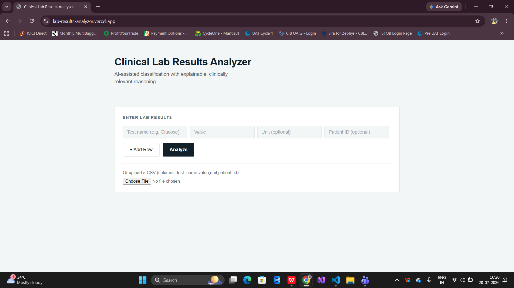
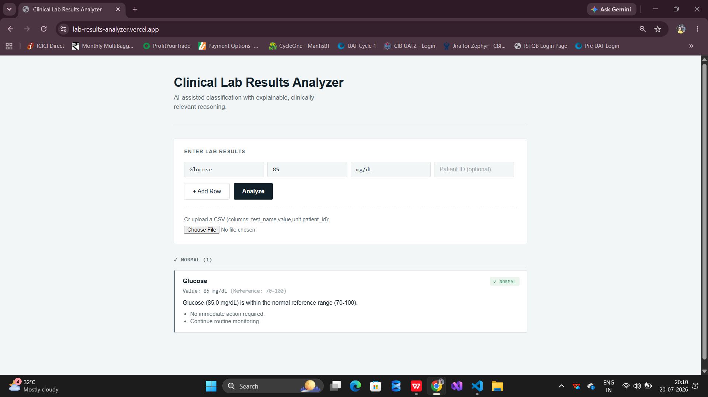
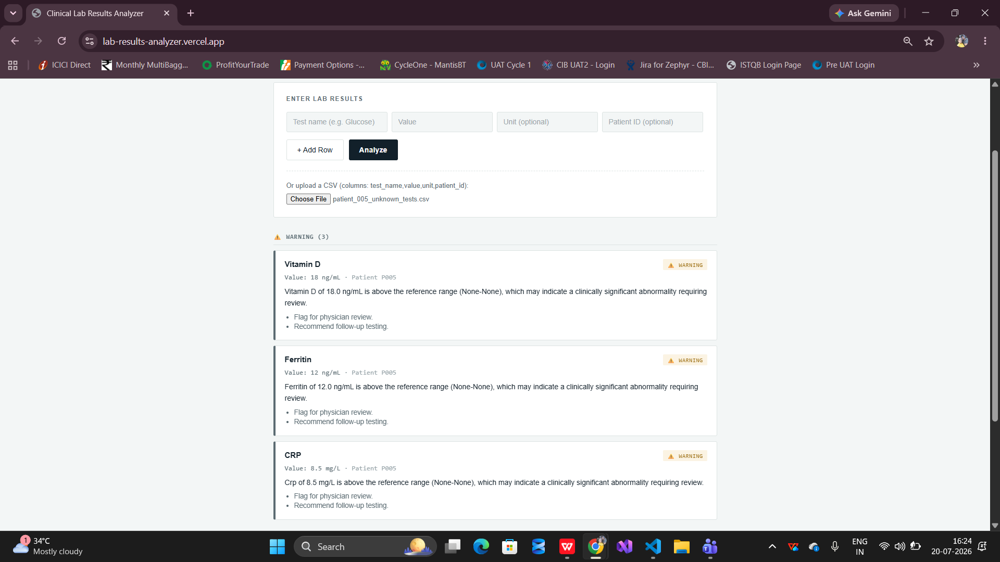

https://github.com/user-attachments/assets/8c1c6312-496c-4e40-8c3b-bef41c082e78


https://github.com/user-attachments/assets/652b1378-9b83-4eb3-9df9-764c71f65aaf


# 🩺 Clinical Lab Results Analyzer

An AI-powered web application that analyzes clinical laboratory test results, classifies them using standard medical reference ranges, and generates patient-friendly explanations with actionable recommendations using **Google Gemini AI**.


---

# 🌐 Live Demo

### Frontend

https://lab-results-analyzer.vercel.app/

### Backend API

https://lab-results-analyzer-2.onrender.com

### Swagger Documentation

https://lab-results-analyzer-2.onrender.com/docs

---

# 📖 Overview

Clinical Lab Results Analyzer is an AI-assisted healthcare application that helps users interpret laboratory reports.

Users can:

- Enter one or multiple laboratory test results
- Upload laboratory data through CSV files
- Automatically classify results
- View medical reference ranges
- Receive AI-generated explanations
- Get suggested next steps
- Identify Critical, Warning, and Normal results instantly

---

# ✨ Features

- 🤖 AI-powered explanations using Google Gemini
- 🩺 Automatic laboratory result classification
- 📊 Medical reference range validation
- 🚨 Severity categorization
  - Critical
  - Warning
  - Normal
- 📁 CSV Upload Support
- 👤 Optional Patient ID support
- 📱 Responsive UI
- ⚡ FastAPI REST API
- 📖 Swagger API Documentation
- 🌐 Fully deployed using Vercel & Render

---

# 🏗️ System Architecture

```text
                React Frontend
                       │
                       ▼
              FastAPI REST API
                       │
                       ▼
            Laboratory Classifier
                       │
                       ▼
          Reference Range Validation
                       │
                       ▼
              Google Gemini API
                       │
                       ▼
       AI Generated Medical Explanation
                       │
                       ▼
             Structured JSON Response
```

---

# 🛠 Tech Stack

## Frontend

- React
- JavaScript
- Axios
- CSS

## Backend

- FastAPI
- Python
- Pydantic
- Uvicorn

## AI Integration

- Google Gemini API

## Deployment

- Vercel
- Render

---

# 📂 Project Structure

```text
lab-results-analyzer/
│
├── backend/
│   ├── __pycache__/
│   ├── .env.example
│   ├── .python-version
│   ├── agent.py
│   ├── main.py
│   ├── models.py
│   ├── reference_ranges.py
│   ├── requirements.txt
│   └── runtime.txt
│
├── frontend/
│   ├── public/
│   ├── src/
│   │   ├── components/
│   │   ├── api.js
│   │   ├── App.css
│   │   ├── App.jsx
│   │   └── index.js
│   │
│   ├── package.json
│   └── package-lock.json
│
├── Screenshots/
│
├── test_data/
│
├── .gitignore
│
└── README.md
```

---

# 🚀 Getting Started

## 1. Clone Repository

```bash
git clone https://github.com/Sashank-09/lab-results-analyzer

cd lab-results-analyzer
```

---

# Backend Setup

```bash
cd backend

python -m venv venv
```

Activate virtual environment

### Windows

```bash
venv\Scripts\activate
```

### Linux / macOS

```bash
source venv/bin/activate
```

Install dependencies

```bash
pip install -r requirements.txt
```

Create `.env`

```env
GEMINI_API_KEY=YOUR_API_KEY
```

Run Backend

```bash
uvicorn main:app --reload
```

Backend runs on

```
http://localhost:8000
```

Swagger UI

```
http://localhost:8000/docs
```

---

# Frontend Setup

```bash
cd frontend

npm install

npm run dev
```

Frontend runs on

```
http://localhost:3000
```

---

# 📡 API Endpoint

## Analyze Laboratory Results

### POST

```
/analyze_labs
```

### Example Request

```json
{
  "labs": [
    {
      "test_name": "Glucose",
      "value": 145,
      "unit": "mg/dL",
      "patient_id": "P001"
    },
    {
      "test_name": "Hemoglobin",
      "value": 15,
      "unit": "g/dL",
      "patient_id": "P001"
    }
  ]
}
```

---

### Example Response

```json
{
  "critical": [],
  "warning": [
    {
      "test_name": "Glucose",
      "status": "Warning"
    }
  ],
  "normal": [
    {
      "test_name": "Hemoglobin",
      "status": "Normal"
    }
  ],
  "errors": []
}
```

---

# 📸 Screenshots

## Home Page



---

## Manual Input Form



---

## CSV Upload



---

# 🧠 AI Processing Workflow

```text
User Input
      │
      ▼
React Frontend
      │
      ▼
FastAPI Backend
      │
      ▼
Reference Range Validation
      │
      ▼
Severity Classification
      │
      ▼
Google Gemini AI
      │
      ▼
Patient-Friendly Explanation
      │
      ▼
Categorized Results Returned
```

---

# 📌 Future Enhancements

- Export reports as PDF
- User Authentication
- Patient History
- Doctor Dashboard
- Trend Analysis
- OCR Support for Lab Reports
- Dark Mode
- Multi-language Support
- Interactive Charts

---

# ⚠ Disclaimer

This application is intended for educational and demonstration purposes only.

The AI-generated explanations are designed to assist users in understanding laboratory test results and should **not** be considered medical advice.

Always consult a qualified healthcare professional for diagnosis and treatment.

---

# 👨‍💻 Author

**Sashank Enukurthi**

GitHub: https://github.com/Sashank-09

LinkedIn: https://www.linkedin.com/in/sashank-enukurthi
